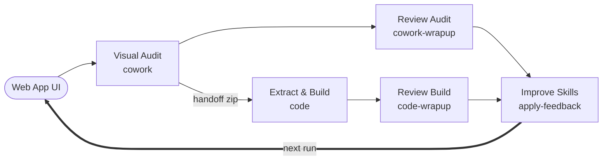

# skill-outputs/

Archived outputs from AI skill runs against the Prometheus UI. Each run is a numbered subfolder that captures the full artifact set produced by a pair of skills: the visual UI audit ([design-system-extraction-cowork](../.claude/skills/)) and the design-token/component extraction ([design-system-extraction-code](../.claude/skills/)).

Runs are numbered sequentially. A run corresponds to one end-to-end execution of both skills against a specific target URL and commit of the Prometheus web UI.

## Contents

| Folder | Target URL | Date | Status |
|--------|-----------|------|--------|
| [run1/](run1/) | https://prometheus-e83j.onrender.com | 2026-04-21 | Complete |

## Skill loop

Five skills form a self-improving loop. Each run produces a design system artifact set and a set of feedback documents. The feedback is then applied back to the skills before the next run.

All skill names in the diagram are shortened — the full prefix is `design-system-extraction-` (e.g. `design-system-extraction-cowork`). The thick arrow marks the feedback loop back into the next run.

### Skill summary

| Skill | Tool | Input | Output | Role |
|-------|------|-------|--------|------|
| `design-system-extraction-cowork` | Claude Cowork | Web app URL | `audit-results.json`, `screenshots/`, `CLAUDE.md` | Phase 0–1: visual audit and handoff package |
| `design-system-extraction-code` | Claude Code | Handoff zip (+ optional source repo) | `tokens.json`, `components.json`, static docs site, Figma plugin, GitHub Pages deployment | Phase 1-S through 6: token/component extraction, docs, deploy |
| `design-system-extraction-cowork-wrapup` | Claude Code | Handoff zip + run ID | Cowork friction doc, reference comparison doc, side-by-side HTML | Post-run analysis of the Cowork session |
| `design-system-extraction-code-wrapup` | Claude Code | Project folder + run ID | Code friction doc | Post-run analysis of the Claude Code session |
| `design-system-apply-feedback` | Claude Code | Both wrapup docs + run ID | Patched skill files, bumped versions, rebuilt zips, commits | Closes the loop — feeds run N findings back into skill v(N+1) |

---

## How a run is structured

Each run folder contains:

- **Raw skill output zips** — the files handed off by Cowork and Claude Code
- **Unpacked combined output** — the full artifact tree ready to browse locally or serve as a static site
- **Feedback documents** — post-run analysis of skill friction points and proposed fixes

See the README inside each run folder for artifact-level detail.
